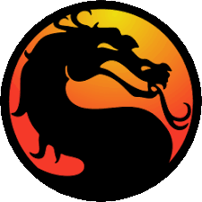
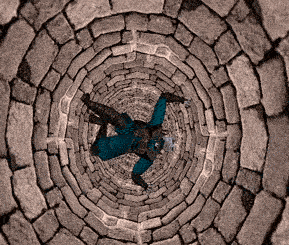

#  MK4 - Matching Decompilation

```diff
- WARNING! -

This repository is a work in progress.
```

A **matching decompilation** of **Mortal Kombat 4** (PC, 1998).

Goal: reproduce `MK4.EXE` **byte-for-byte** from reconstructed C source,
compiled with the original toolchain (Microsoft Visual C++ 5.0). Once
matching, the C source is the canonical representation of the game.

## Status

```
$ make progress
Functions identified    :  2824 (full call-graph reach from known set)
matched (byte-perfect)  :  2758
drafted (functional)    :     0
stub (asm-only)         :   65

Bytes of .text covered  : 695775 / 975765 (71.3% of identified)
```

See [analysis/notes/architecture.md](analysis/notes/architecture.md)
for the architectural map already produced by static RE - every
subsystem of the engine is documented at a high level.

## Repo layout

| Path | Contents |
|---|---|
| `src/` | Reconstructed C source, organized by subsystem |
| `include/` | Reconstructed headers |
| `config/` | Symbol map (`symbols.yaml`), linker script, splits |
| `tools/decomp/` | Diff, progress, build pipeline |
| `tools/ghidra_scripts/` | Jython scripts for Ghidra automation |
| `analysis/` | Notes, Ghidra DB |
| `original/` | Original CD image (`MortalK4.bin`+`.cue`). Source of truth. |
| `game/` | Extracted game files (target = `game/MK4.EXE`). |
| `audio/` | Extracted CD-DA tracks |
| `docs/` | Build / matching / contributing docs |

## Build (matching)

The matching build needs MSVC 5.0 SP3 (cl 11.00.7022, link 5.00.7022).
I run it under Wine on macOS via Whisky.

```sh
./tools/setup-macos.sh                # first-time setup
./tools/decomp/setup-msvc50.sh        # install MSVC 5.0 in a Whisky bottle
make matching                         # rebuild MK4.EXE (byte-identical once all functions are matched)
make diff                             # compare each function vs original
```

When a function matches byte-for-byte, mark it `matched` in
`config/symbols.yaml`.

## Contributing

All contributions are welcome. This is a group effort, and even small contributions can make a difference.
Some tasks also don't require much knowledge to get started.

1. [analysis/notes/architecture.md](analysis/notes/architecture.md) -
   what the engine does, subsystem-by-subsystem
2. [CONVENTIONS.md](CONVENTIONS.md) - naming, header layout, matching rules
3. [docs/MATCHING.md](docs/MATCHING.md) - workflow for claiming a function
   and getting it byte-perfect
4. [config/symbols.yaml](config/symbols.yaml) - find a `stub` function to
   work on

By submitting a contribution, you confirm that your work is your own
original reconstruction, derived only from static analysis of a
legally-obtained binary (no leaked source, no copy-paste from a
non-clean-room decompiler dump that was then republished), and that
you agree to release it under the project's [LICENSE](LICENSE).

## Regenerating `game/` from the CD image

If `game/` is ever lost, rebuild from `original/` (which you ripped
yourself from your own legally-purchased MK4 CD-ROM):

```sh
cd /tmp && bchunk -w \
  ../original/MortalK4.bin ../original/MortalK4.cue MK4
7z x MK401.iso
# move DATA/MK4.EXE, DATA/FILESYS.DAT, DATA/*.ECM, 3DFX/GRTVGR.EXE → game/
```

## Toolchain

- **Ghidra** - disassembly + interactive decompilation
- **Whisky** - Wine wrapper used to run MSVC 5.0 and the original `MK4.EXE`
- **MSVC 5.0 SP3** (under Wine) - for the matching build
- **Python 3 + pyyaml** - for tooling

## License

The original contributions of this project - the reconstructed C
source, headers, build infrastructure, tools, scripts, and
documentation - are released under the [MIT License](LICENSE).

This license applies only to the project's own contributions. It does
**not** grant any rights to *Mortal Kombat 4* itself, its assets, or
any code or data owned by Warner Bros. Entertainment Inc., NetherRealm
Studios, or Midway Games.

## Legal

**Methodology.** This is a clean-room reverse-engineering effort. The
C source is reconstructed exclusively from **static analysis of a
legally-obtained binary** (Ghidra disassembly, manual matching against
the original `.text`). No leaked source code has been used, consulted,
or referenced at any point. The result is the project authors' own
expression that happens, when compiled under the original toolchain,
to produce a byte-identical binary.

**No affiliation.** This project is not affiliated with, endorsed by,
or sponsored by Warner Bros. Entertainment Inc., NetherRealm Studios,
Midway Games, or any other rights holder.

**Trademarks and copyright of the game.** *Mortal Kombat* and all
related characters, names, marks, and assets are trademarks of and ©
Warner Bros. Entertainment Inc. / Warner Bros. Discovery. *Mortal
Kombat 4* was originally developed in 1998 by the Midway Games team
that later became NetherRealm Studios (now part of Warner Bros.
Games). All rights to the game itself remain with their respective
owners.

**No game assets distributed.** This repository distributes **zero**
original game assets, code, or data. The `original/`, `game/`, and
`audio/` paths are git-ignored. To run the result you must provide
your own legally-obtained copy of MK4.

**No redistribution value.** The compiled output of this project is
byte-identical to the original `MK4.EXE`. It is a *proof of matching*,
not a substitute for owning the game.

## Contributors

This project exists thanks to all the people who contribute. [[Contribute]](#contributing).

<a href="https://github.com/nathan-casabieille/mk4decomp/graphs/contributors">
  
</a>

---

<p align="center">
  
</p>