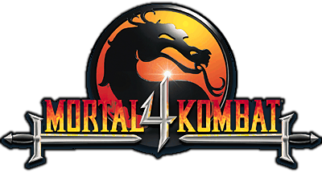

#  MK4 - Matching Decompilation

[](https://github.com/nathan-casabieille/mk4decomp/actions/workflows/ci.yml)

A **matching decompilation** of **Mortal Kombat 4** (PC, 1998).

Goal: reproduce `MK4.EXE` **byte-for-byte** from reconstructed C source,
compiled with the original toolchain (Microsoft Visual C++ 5.0). Once
matching, the C source is the canonical representation of the game.

## Status

<p align="center">
  
</p>

<p align="center">
  
</p>

| Metric | Progress |
|---|---|
| Byte-perfect rebuild | **100%** (2829 / 2829 functions) |
| **Pure C (no `__asm`)** | **~42%** (1216 / 2844 functions) - contributions welcome |
| Hybrid (no `naked`, body still `__asm`) | ~10% (285 / 2844 functions) |
| Still `__declspec(naked)` | ~48% (1344 / 2844 functions) |

In plain words:

- **Byte-perfect rebuild = done.** `make matching` produces a
  `build/MK4.matching.exe` that is MD5-identical to `game/MK4.EXE`.
  Every function in the original `.text` has a counterpart in our source
  whose compiled bytes match orig byte-for-byte (reloc-aware diff via
  `tools/decomp/diff_fn_obj.py`).

  ```
  $ md5 build/MK4.matching.exe game/MK4.EXE
  MD5 (build/MK4.matching.exe) = a3d2bf7f1222e5fcf8df93c7d8d8b5cf
  MD5 (game/MK4.EXE)           = a3d2bf7f1222e5fcf8df93c7d8d8b5cf
  ```

- **Pure C = the real decompilation metric.** Only functions whose body
  contains no `__asm` block count - i.e. portable C, retargetable to a
  non-x86 build (e.g. WASM/Emscripten). The progress bar tracks this.
  **This is where contributions are needed.**

Run `python3 tools/decomp/progress.py` for a live per-subsystem breakdown.

The rebuild path:
1. **MSVC 5.0 SP3 compiles** every C source (`src/*.c`) to COFF `.obj` files.
2. **`tools/decomp/synthesize.py`** (custom mini-linker) walks each `.obj`,
   locates every named function, applies COFF relocations using a cascading
   lookup, and overlays the bytes at the function's orig VA. Resolution
   sources (all checked into the repo):
   - `config/symbols.yaml` - canonical name + VA for every matched function
   - `include/**/*.h` - `/* 0xADDR */` comments after extern declarations
   - `config/iat_map.yaml` - Win32 IAT slot VAs (extracted once from PE imports)
   - `config/extras_map.yaml` - learned address annotations for hand-coded globals
   - `config/reloc_sites.yaml` - per-site disambiguation for the 507 truly-ambiguous
     references where one source symbol maps to multiple distinct VAs
3. **Verification.** `make matching` fails if a single byte differs from orig.

**Scaffold model.** The non-`.text` content (PE header, IAT, `.rdata`, `.data`,
`.rsrc`) is taken byte-for-byte from `game/MK4.EXE` and reused under the
matching-decomp convention that *binary assets need not be re-emitted from
source* (cf. oot's textures/sounds in `.bin` files). All **code** in `.text`
is fully synthesized from our compiled OBJs - the scaffold is overwritten
inside every function range with our reloc-resolved bytes.

`tools/decomp/learn_sites.py` is a one-time bootstrap that derived
`config/reloc_sites.yaml` from orig. Once committed, the build does **not**
consult orig at the link step - resolution uses the checked-in tables.
Orig is read only at verification.

See [analysis/notes/architecture.md](analysis/notes/architecture.md)
for the architectural map already produced by static RE - every
subsystem of the engine is documented at a high level.

## Repo layout

| Path | Contents |
|---|---|
| `src/` | Reconstructed C source, organized by subsystem |
| `include/` | Reconstructed headers |
| `config/` | Symbol map (`symbols.yaml`), linker script, splits |
| `tools/decomp/` | Diff, progress, build pipeline |
| `tools/ghidra_scripts/` | Jython scripts for Ghidra automation |
| `analysis/` | Notes, Ghidra DB |
| `original/` | Original CD image (`MortalK4.bin`+`.cue`). Source of truth. |
| `game/` | Extracted game files (target = `game/MK4.EXE`). |
| `audio/` | Extracted CD-DA tracks |
| `docs/` | Build / matching / contributing docs |

## Build (matching)

The matching build needs MSVC 5.0 SP3 (cl 11.00.7022, link 5.00.7022).
I run it under Wine on macOS via Whisky.

```sh
./tools/setup-macos.sh                # first-time setup
./tools/decomp/setup-msvc50.sh        # install MSVC 5.0 in a Whisky bottle
make matching                         # rebuild MK4.EXE (byte-identical once all functions are matched)
make diff                             # compare each function vs original
```

When a function matches byte-for-byte, mark it `matched` in
`config/symbols.yaml`.

## In action

<p align="center">
  
  <br>
  <em>Gameplay from <code>build/MK4.matching.exe</code> - the byte-identical rebuild.</em>
</p>

## Contributing

**The byte-match is done. The C decompilation is not.** About 1639
functions in `src/` (1354 naked + 285 hybrid) still have an
`__asm { ... }` block in their body. Each one needs to be rewritten in
pure C while keeping `make matching` byte-identical to orig.

### Pick a function and convert it

```sh
# 1. Find a function that still contains __asm in any file under src/.
#    Either fully naked (preferred for clean conversions) or hybrid.
grep -l "__declspec(naked)" src/ -r | head      # fully naked
grep -lE "\b__asm\b"        src/ -r | head      # naked OR hybrid

# 2. Rewrite the body in pure C in the same file (drop both the
#    __declspec(naked) qualifier - if present - and the __asm block),
#    using the matching tactics documented in docs/MATCHING.md.

# 3. Compile just that file and diff against orig (per-function,
#    reloc-aware).
python3 tools/decomp/diff_fn_obj.py build/obj/<path>.obj <SymbolName> <addr> <size>

# 4. Re-run the whole-EXE synth - it must still report byte-identical.
python3 tools/decomp/synthesize.py
```

Easy entry points (small files, no risky reloc-site overrides):

- Any `src/engine/misc_matches*.c` not listed in `config/reloc_sites.yaml`
- The `tools/decomp/progress.py` per-subsystem breakdown shows which
  groups have the lowest C-conversion rate

Reading order before you start:

1. [analysis/notes/architecture.md](analysis/notes/architecture.md) -
   what the engine does, subsystem-by-subsystem
2. [CONVENTIONS.md](CONVENTIONS.md) - naming, header layout, matching rules
3. [docs/MATCHING.md](docs/MATCHING.md) - workflow for claiming a function
   and getting it byte-perfect

By submitting a contribution, you confirm that your work is your own
original reconstruction, derived only from static analysis of a
legally-obtained binary (no leaked source, no copy-paste from a
non-clean-room decompiler dump that was then republished), and that
you agree to release it under the project's [LICENSE](LICENSE).

## Regenerating `game/` from the CD image

If `game/` is ever lost, rebuild from `original/` (which you ripped
yourself from your own legally-purchased MK4 CD-ROM):

```sh
cd /tmp && bchunk -w \
  ../original/MortalK4.bin ../original/MortalK4.cue MK4
7z x MK401.iso
# move DATA/MK4.EXE, DATA/FILESYS.DAT, DATA/*.ECM, 3DFX/GRTVGR.EXE → game/
```

## Toolchain

- **Ghidra** - disassembly + interactive decompilation
- **Whisky** - Wine wrapper used to run MSVC 5.0 and the original `MK4.EXE`
- **MSVC 5.0 SP3** (under Wine) - for the matching build
- **Python 3 + pyyaml** - for tooling

## License

The original contributions of this project - the reconstructed C
source, headers, build infrastructure, tools, scripts, and
documentation - are released under the [MIT License](LICENSE).

This license applies only to the project's own contributions. It does
**not** grant any rights to *Mortal Kombat 4* itself, its assets, or
any code or data owned by Warner Bros. Entertainment Inc., NetherRealm
Studios, or Midway Games.

## Legal

**Methodology.** This is a clean-room reverse-engineering effort. The
C source is reconstructed exclusively from **static analysis of a
legally-obtained binary** (Ghidra disassembly, manual matching against
the original `.text`). No leaked source code has been used, consulted,
or referenced at any point. The result is the project authors' own
expression that happens, when compiled under the original toolchain,
to produce a byte-identical binary.

**Trademarks and copyright of the game.** *Mortal Kombat* and all
related characters, names, marks, and assets are trademarks of and ©
Warner Bros. Entertainment Inc. / Warner Bros. Discovery. *Mortal
Kombat 4* was originally developed in 1998 by the Midway Games team
that later became NetherRealm Studios (now part of Warner Bros.
Games). All rights to the game itself remain with their respective
owners.

**No game assets distributed.** This repository distributes **zero**
original game assets, code, or data. The `original/`, `game/`, and
`audio/` paths are git-ignored. To run the result you must provide
your own legally-obtained copy of MK4.

## Contributors

This project exists thanks to all the people who contribute. [[Contribute]](#contributing).

<a href="https://github.com/nathan-casabieille/mk4decomp/graphs/contributors">
  
</a>

---

<p align="center">
  
</p>