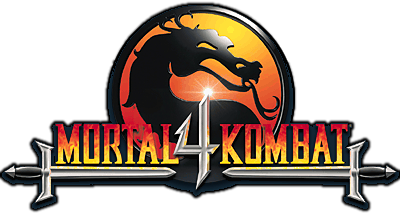
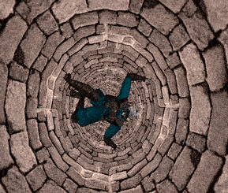

#  MK4 - Matching Decompilation

[](https://github.com/nathan-casabieille/mk4decomp/actions/workflows/ci.yml)

A **matching decompilation** of **Mortal Kombat 4** (PC, 1998).

Goal: reproduce `MK4.EXE` **byte-for-byte** from reconstructed C source,
compiled with the original toolchain (Microsoft Visual C++ 5.0). Once
matching, the C source is the canonical representation of the game.

## Status

<p align="center">
  
</p>

<p align="center">
  
</p>

The decomp moves along several independent axes. A single "pure C %"
number conflates portability with comprehension and gives the wrong
picture once the pure-C ceiling is reached. The metrics below are
orthogonal; each one captures a different kind of progress.

| Axis | Value | What it measures |
|---|---|---|
| **Byte-perfect rebuild** | **100%** (2914 / 2914 fns) | `make matching` produces a binary that is MD5-identical to orig. Locked. The foundation - everything else must preserve it. |
| **Pure C portability** | ~49% (1423 / 2914 fns) - *ceiling reached* | Fns with no `__asm` block. Relevant for a future WASM / Emscripten port. **Has a practical ceiling around 49%** under MSVC 5.0 SP3; the remaining functions have all been surveyed and the failure modes documented per-function in `NON-COAXABLE:` comments. |
| **Function naming** | tickers up with [Priority 4](#4-rename-functions-to-what-they-actually-do) | % of fns in `symbols.yaml` whose name has NO `_00xxxxxx` address suffix. `LoadGeoAsset_Textures` = named; `Helper_00412ff0` = placeholder waiting for investigation. |
| **Global naming** | tickers up with [Priority 3](#3-rename-globals-to-what-they-actually-do) | Same idea for the `g_*` globals declared in `include/`. `g_framePauseFlag` = named; `g_audioBank_005433c0` = address-disambiguated and worth promoting. |
| **Struct field coverage** | tickers up with [Priority 1](#1-reconstruct-typed-structs) | % of fields in `typedef struct` blocks under `include/` that have a real name (not `_NN` / `_NN[K]`). Each `ScenegraphNode` / `FightGroupNode` / `DrawEntry` slot named ticks it up. |
| **Functional understanding** | mean of the three naming axes above | The composite shown on top of the SVG. Excludes byte-match (always 100%, doesn't move) and pure C (ceiling, would unfairly cap the score). This is the headline number that reflects *current* work velocity. |

In plain words:

- **Byte-perfect rebuild = done.** `make matching` produces a
  `build/MK4.matching.exe` that is MD5-identical to `game/MK4.EXE`.
  Every function in the original `.text` has a counterpart in our source
  whose compiled bytes match orig byte-for-byte (reloc-aware diff via
  `tools/decomp/diff_fn_obj.py`).

  ```
  $ md5 build/MK4.matching.exe game/MK4.EXE
  MD5 (build/MK4.matching.exe) = a3d2bf7f1222e5fcf8df93c7d8d8b5cf
  MD5 (game/MK4.EXE)           = a3d2bf7f1222e5fcf8df93c7d8d8b5cf
  ```

- **Pure C ratio has hit its practical ceiling.** The remaining ~896
  naked functions have all been individually surveyed and confirmed
  non-coaxable from pure C against our MSVC 5.0 SP3 toolchain (CL
  11.00.7022). Reasons documented per-function in `NON-COAXABLE:`
  comments: MSVC register-allocator choices that depend on undocumented
  heuristics (flag preservation across stores, raw-index-in-esi SIB
  form, CH/AL byte-register peepholes, cross-path callee-saved
  defaults, etc.). The same compiler version is used for the rebuild,
  yet specific orig patterns cannot be reproduced from any standard C
  construct. The `__asm` blocks that remain are minimal,
  well-documented, and stable. **This is why pure-C % is not the
  headline metric.**

- **Functional understanding is open-ended.** With the byte-match
  locked and the pure-C ceiling reached, current contributions focus
  on **comprehending the engine**: naming functions and globals after
  what they actually do, reconstructing typed `struct`s from raw
  memory layouts (see [analysis/notes/node_struct.md](analysis/notes/node_struct.md)
  for the live work on the central node pool), refining the
  per-subsystem notes (`analysis/notes/`), and cross-referencing IAT
  calls into a documented DirectX/Win32 surface. The composite metric
  on the SVG reflects this work.

Run `python3 tools/decomp/progress.py` for a live multi-axis breakdown
(and a per-subsystem pure-C table).

The rebuild path:
1. **MSVC 5.0 SP3 compiles** every C source (`src/*.c`) to COFF `.obj` files.
2. **`tools/decomp/synthesize.py`** (custom mini-linker) walks each `.obj`,
   locates every named function, applies COFF relocations using a cascading
   lookup, and overlays the bytes at the function's orig VA. Resolution
   sources (all checked into the repo):
   - `config/symbols.yaml` - canonical name + VA for every matched function
   - `include/**/*.h` - `/* 0xADDR */` comments after extern declarations
   - `config/iat_map.yaml` - Win32 IAT slot VAs (extracted once from PE imports)
   - `config/extras_map.yaml` - learned address annotations for hand-coded globals
   - `config/reloc_sites.yaml` - per-site disambiguation for the 507 truly-ambiguous
     references where one source symbol maps to multiple distinct VAs
3. **Verification.** `make matching` fails if a single byte differs from orig.

**Scaffold model.** The non-`.text` content (PE header, IAT, `.rdata`, `.data`,
`.rsrc`) is taken byte-for-byte from `game/MK4.EXE` and reused under the
matching-decomp convention that *binary assets need not be re-emitted from
source* (cf. oot's textures/sounds in `.bin` files). All **code** in `.text`
is fully synthesized from our compiled OBJs - the scaffold is overwritten
inside every function range with our reloc-resolved bytes.

`tools/decomp/learn_sites.py` is a one-time bootstrap that derived
`config/reloc_sites.yaml` from orig. Once committed, the build does **not**
consult orig at the link step - resolution uses the checked-in tables.
Orig is read only at verification.

See [analysis/notes/architecture.md](analysis/notes/architecture.md)
for the architectural map already produced by static RE - every
subsystem of the engine is documented at a high level.

## Repo layout

| Path | Contents |
|---|---|
| `src/` | Reconstructed C source, organized by subsystem |
| `include/` | Reconstructed headers |
| `config/` | Symbol map (`symbols.yaml`), linker script, splits |
| `tools/decomp/` | Diff, progress, build pipeline |
| `tools/ghidra_scripts/` | Jython scripts for Ghidra automation |
| `analysis/` | Notes, Ghidra DB |
| `original/` | Original CD image (`MortalK4.bin`+`.cue`). Source of truth. |
| `game/` | Extracted game files (target = `game/MK4.EXE`). |
| `audio/` | Extracted CD-DA tracks |
| `docs/` | Build / matching / contributing docs |

## Build (matching)

The matching build needs MSVC 5.0 SP3 (cl 11.00.7022, link 5.00.7022).
I run it under Wine on macOS via Whisky.

```sh
./tools/setup-macos.sh                # first-time setup
./tools/decomp/setup-msvc50.sh        # install MSVC 5.0 in a Whisky bottle
make matching                         # rebuild MK4.EXE (byte-identical once all functions are matched)
make diff                             # compare each function vs original
```

When a function matches byte-for-byte, mark it `matched` in
`config/symbols.yaml`.

## In action

<p align="center">
  
  <br>
  <em>Gameplay from <code>build/MK4.matching.exe</code> - the byte-identical rebuild.</em>
</p>

## Contributing

**The byte-match is done. The C decompilation is at its ceiling.** Most
naked-to-pure-C conversions have already been attempted and the
remaining ~896 naked functions all have at least one MSVC SP3
codegen quirk that pure C cannot reproduce. Each is annotated with a
`NON-COAXABLE:` comment documenting the specific blocker.

Where contributions move the needle now is **functional understanding**:

### 1. Reconstruct typed structs

Most of the engine still treats memory as `unsigned int *` with
hand-computed offsets. Identifying a recurring offset pattern (e.g.
the 232-byte node pool addressed via `[reg*4 + 0xNN]`) and lifting it
to a real `typedef struct` makes hundreds of functions readable
simultaneously. **This is where the live work is** -
[analysis/notes/node_struct.md](analysis/notes/node_struct.md) is the
running hypothesis log; [include/engine/scenegraph.h](include/engine/scenegraph.h)
is the authoritative typedef. Each newly-named slot ticks the **struct
field coverage** axis up.

```sh
# Pick an offset still named `_NN` in a typed struct
grep -nE '_[0-9a-f]{2}(\[|;)' include/engine/scenegraph.h
# Find every reader/writer
grep -RE '\[[a-z]+\*4\s*\+\s*0x4c\]' src/
```

### 2. Refine per-subsystem notes

The originally-targeted subsystem deep-dives all exist in
`analysis/notes/` (15 files: audio, scenegraph, combat FSM, render,
install, etc.). What's left is **refinement**: reconcile notes with
newly-named fields/globals as Priority 1 progresses, resolve
`TODO`/`?` markers when surrounding code becomes legible, add a note
only when a subsystem genuinely lacks one (rare at this point - scan
the directory first).

### 3. Rename globals to what they actually do

The bare `g_(data|state|x)_005xxxxx` placeholders are exhausted. What
remains is ~730 globals that already carry a semantic prefix but
still keep the address suffix for disambiguation (e.g.
`g_audioBankPick_005433c0`). Drop the suffix when the global is
uniquely identifiable; upgrade to a struct field when it sits in a
contiguous block with other named globals; keep the suffix only when
disambiguation truly requires the address. Ticks the **global
naming** axis up.

```sh
# Suffix-still-present globals, ranked by usage
grep -rhoE 'g_[a-zA-Z_]*_00[0-9a-f]{6}' src/ include/ | sort | uniq -c | sort -rn | head
```

### 4. Rename functions to what they actually do

Many functions still carry generated names like `Helper_004xxxxx`,
`MStackBracket_004xxxxx`. Pick one, read it alongside its callers,
give it a semantic name in `config/symbols.yaml`, and optionally add
a one-line comment summarising its job. Ticks the **function
naming** axis up.

```sh
# Functions still labelled with an address suffix
grep -E '^    name:' config/symbols.yaml | grep -E '_00[0-9a-f]{6}$' | head
```

### 5. Document the IAT / Win32 surface

`config/iat_map.yaml` lists every Win32 import. Annotating which
internal wrapper calls which API, and grouping them by use case
(DirectDraw blit, DirectSound buffer, WinMM timing, etc.) turns the
repo into a reference for anyone porting the engine.

### Reading order

1. [analysis/notes/architecture.md](analysis/notes/architecture.md) -
   what the engine does, subsystem-by-subsystem
2. [CONVENTIONS.md](CONVENTIONS.md) - naming, header layout, matching rules
3. [docs/MATCHING.md](docs/MATCHING.md) - byte-match workflow (still
   useful if a new candidate function is added, or when refactoring
   while preserving byte identity)

### If you really want to chase a naked-to-pure-C conversion

It is genuinely hard. Read all the `NON-COAXABLE:` comments in
`src/**/*.c` first - the failure modes have already been catalogued.
A successful conversion requires beating a constraint that has resisted
multiple prior attempts, typically via a non-obvious C construct or a
per-file pragma. Use `python3 tools/decomp/fast_try.py` for rapid
iteration, then `make matching` to verify whole-EXE identity.

By submitting a contribution, you confirm that your work is your own
original reconstruction, derived only from static analysis of a
legally-obtained binary (no leaked source, no copy-paste from a
non-clean-room decompiler dump that was then republished), and that
you agree to release it under the project's [LICENSE](LICENSE).

## Regenerating `game/` from the CD image

If `game/` is ever lost, rebuild from `original/` (which you ripped
yourself from your own legally-purchased MK4 CD-ROM):

```sh
cd /tmp && bchunk -w \
  ../original/MortalK4.bin ../original/MortalK4.cue MK4
7z x MK401.iso
# move DATA/MK4.EXE, DATA/FILESYS.DAT, DATA/*.ECM, 3DFX/GRTVGR.EXE → game/
```

## Toolchain

- **Ghidra** - disassembly + interactive decompilation
- **Whisky** - Wine wrapper used to run MSVC 5.0 and the original `MK4.EXE`
- **MSVC 5.0 SP3** (under Wine) - for the matching build
- **Python 3 + pyyaml** - for tooling

## License

The original contributions of this project - the reconstructed C
source, headers, build infrastructure, tools, scripts, and
documentation - are released under the [MIT License](LICENSE).

This license applies only to the project's own contributions. It does
**not** grant any rights to *Mortal Kombat 4* itself, its assets, or
any code or data owned by Warner Bros. Entertainment Inc., NetherRealm
Studios, or Midway Games.

## Legal

**Methodology.** This is a clean-room reverse-engineering effort. The
C source is reconstructed exclusively from **static analysis of a
legally-obtained binary** (Ghidra disassembly, manual matching against
the original `.text`). No leaked source code has been used, consulted,
or referenced at any point. The result is the project authors' own
expression that happens, when compiled under the original toolchain,
to produce a byte-identical binary.

**Trademarks and copyright of the game.** *Mortal Kombat* and all
related characters, names, marks, and assets are trademarks of and ©
Warner Bros. Entertainment Inc. / Warner Bros. Discovery. *Mortal
Kombat 4* was originally developed in 1998 by the Midway Games team
that later became NetherRealm Studios (now part of Warner Bros.
Games). All rights to the game itself remain with their respective
owners.

**No game assets distributed.** This repository distributes **zero**
original game assets, code, or data. The `original/`, `game/`, and
`audio/` paths are git-ignored. To run the result you must provide
your own legally-obtained copy of MK4.

## Contributors

This project exists thanks to all the people who contribute. [[Contribute]](#contributing).

<a href="https://github.com/nathan-casabieille/mk4decomp/graphs/contributors">
  
</a>

---

<p align="center">
  
</p>